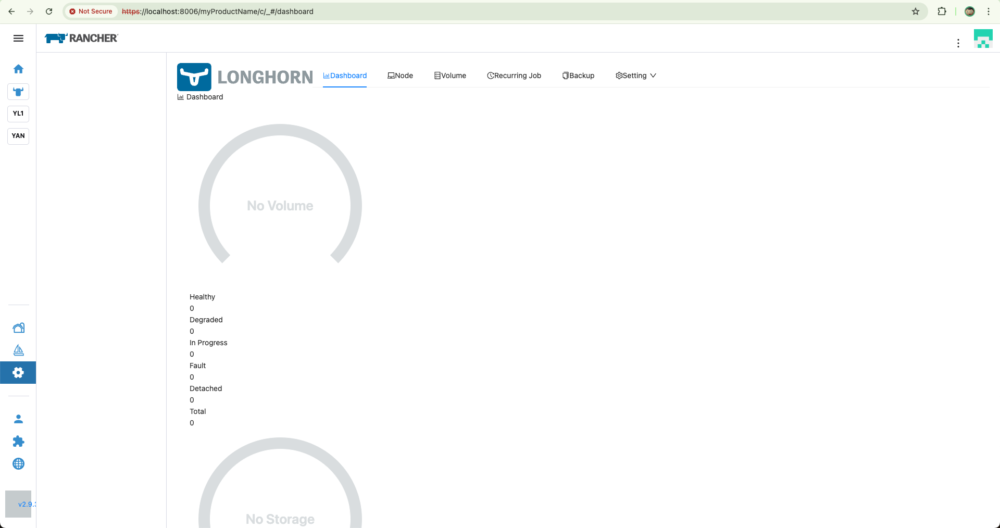
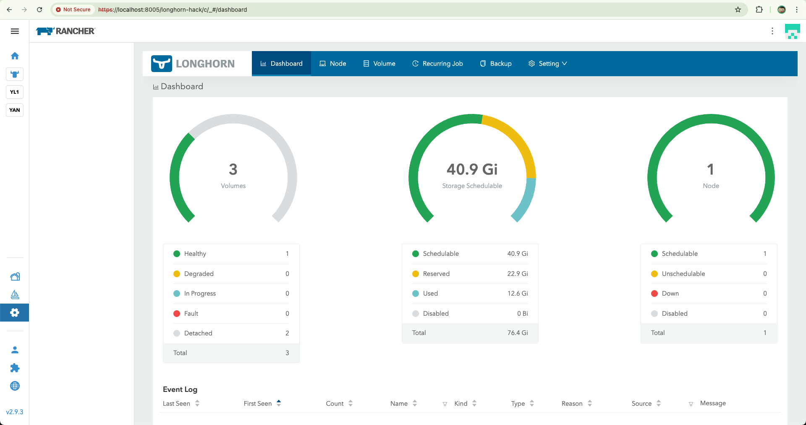

# React in Vue

## Overview

This project explores integrating React with Vue to create a Longhorn UI extension (look and feel) in Rancher.

## Approaches Tried

I experimented with two approaches to achieve this:

1. **Veaury** – A library to transform React components into Vue-readable components.
2. **Module Federation** – A modern approach to share modules between React and Vue.

## Results

### 1. **Veaury (Compile-time)**
The integration using Veaury didn't go as smoothly as expected.

*Challenges:*
- Missing styles when rendering React components in Vue.
- CORS issue with API calls, which caused some functionality to break.

### 2. **Module Federation (Runtime)**
This approach was successful. This runtime solution allowed for the seamless sharing of React and Vue components. The result was closer to the intended Longhorn UI extension experience.

## Conclusion

This project is an ongoing exploration into making React and Vue work together seamlessly within the Rancher environment. While Veaury had some challenges, the Module Federation approach offers a good path forward for creating a robust Longhorn UI extension within Rancher.
dsa
