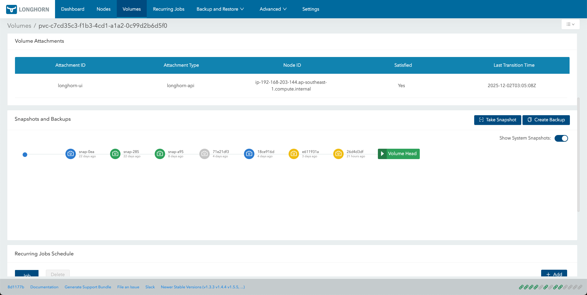
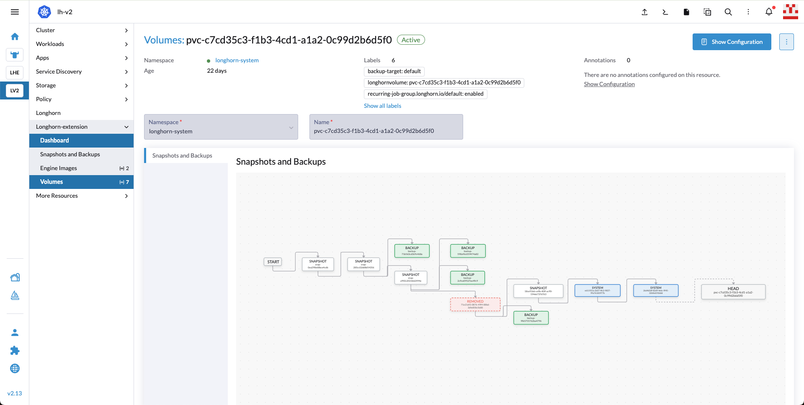
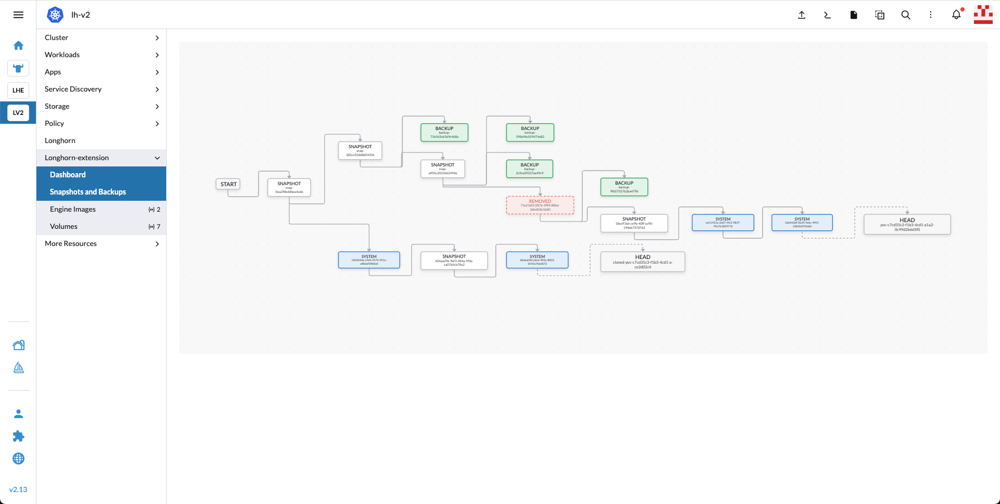

# Longhorn Snapshot and Backup Flow

## Project Overview
A modern visualization tool for Longhorn snapshots and backups, designed to make the relationships between volumes, snapshots, and backups clear and intuitive.

This project rewrites the existing Longhorn UI component using `Vue Flow`, transforming the original linear chain interface into a more structured, interactive flow layout while preserving the linear history and backup context.

---

## Key Features

### 1. Snapshot & Backup Flow Visualization
- Backups and clone operations are visualized as branches extending from the main snapshot timeline or other clones.

### 2. Cross-Volume Aggregation
- Aggregates snapshots and backups from a primary volume and all related cloned volumes into a single continuous view.

### 3. Branching Lineage Visualization
- Clone operations are rendered as separate horizontal tracks (branches).
- Enables tracing data flow from the main production timeline to derived testing or development environments.

### 4. Structural Flow Layout
- Utilizes **Vue Flow** with the **Dagre layout engine** for a clean, orthogonal (right-angle) structure.
- Complex chains of backups and snapshots are neatly separated onto distinct vertical tracks for clarity.

---

## Benefits
- Quickly understand snapshot and backup relationships
- Easily identify restore points for disaster recovery
- Simplifies data governance by visualizing multiple related volumes in one view
- Enhances Longhorn UI with modern, interactive, and maintainable Vue components

---

## Tech Stack
- `Vue 3` + `Vue Flow` for interactive flow visualization
- `Dagre` Layout Engine for structured, orthogonal node placement
- Integration with Longhorn CRDs to fetch snapshots, backups, and volume relationships

---

## Hackweek Goal
Reimagine Longhorn snapshot and backup visualization to make lineage relationships transparent, understandable, and actionable. Enable cross-volume aggregation and branching visualization for better operational insights.

---

### Single Volume Flow

### Multi-Volume Aggregation

