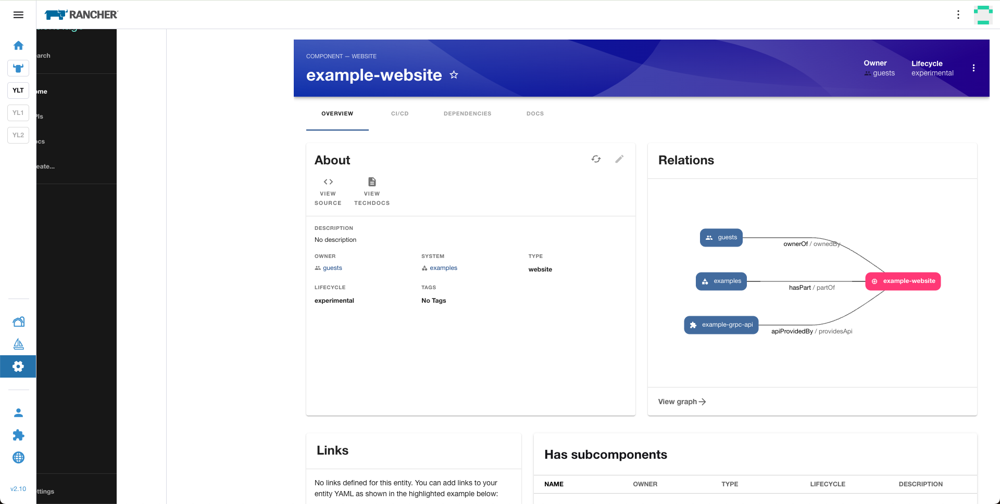

# React in Vue: Bring Backstage into Rancher

## Overview

Integrating React with Vue to create a Backstage extension.<br>
> Note: some styles require adjustments to resolve minor styling issues, but overall, the functionality works well.



## Project Setup

1. set up Rancher UI extension (Vue@3)
```
yarn install
```
```
API=<Rancher Backend URL> yarn dev
```

2. set up Backstage application
```
cd pkg/backstage
```
```
yarn install
```
``` js
// Temporary workaround: no better solution found for patching @backstage-cli packages
// pkg/backstage/node_modules/@backstage/cli/dist/lib/bundler/config.cjs.js
// Add the following code within the createConfig function
options.moduleFederation = {
    mode: 'remote',
    name: 'backstageApp',
    exposes: {
      './App': './src/App.tsx',
    }
}
```
```
yarn dev
```

## Summary of Changes

1. **Install `react`**
   Install `react` under the `mf-backstage` root directory.

2. **Set up module federation Host code**
   Configure the MF host code in `hackweek24/mf-backstage/vue.config.js`.

3. **Integrate Backstage**
   Import and render Backstage in `hackweek24/mf-backstage/pkg/mf-backstage/pages/index.vue`.

4. **Set up module federation Remote App**
   Add the necessary module federation configuration in
   `pkg/backstage/node_modules/@backstage/cli/dist/lib/bundler/config.cjs.js`,

5. **Fix CORS Issues**
   Update the `cors.origin` configuration in
   `hackweek24/mf-backstage/pkg/backstage/app-config.yaml` to resolve CORS-related problems.
